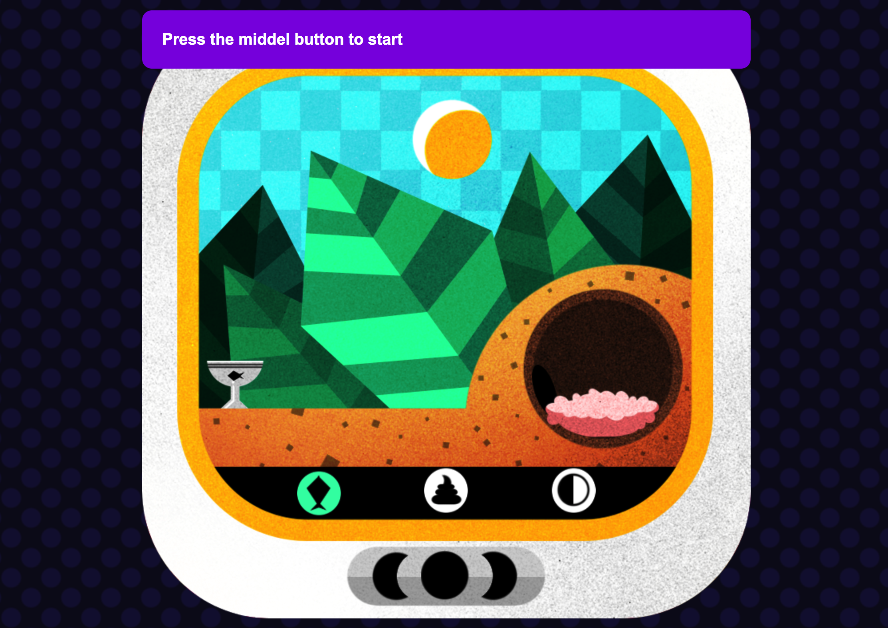
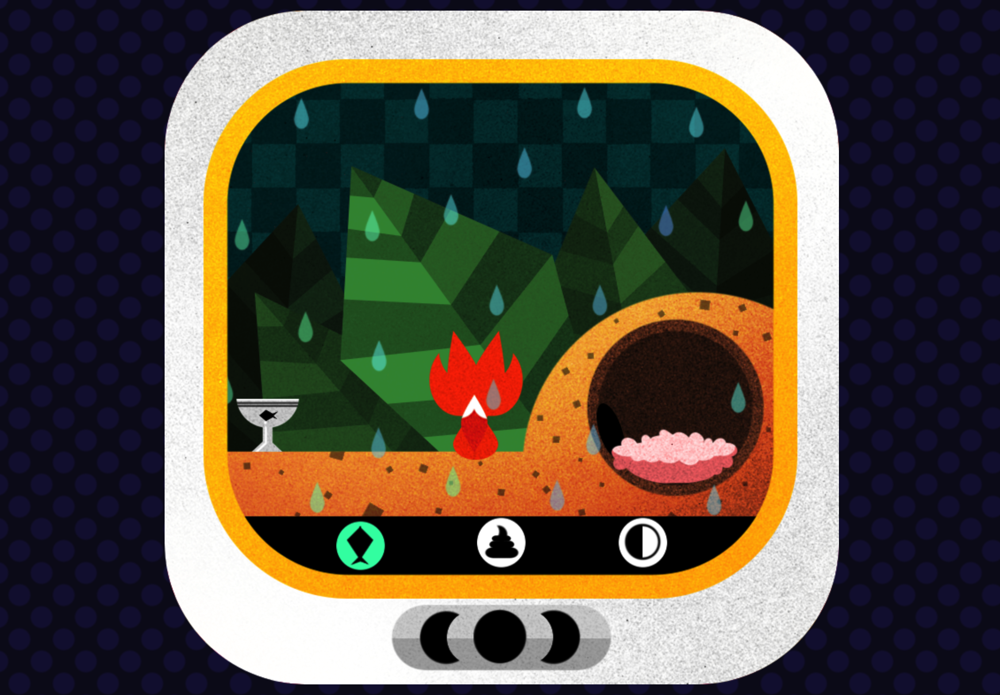

# Building a Game

Vanilla JavaScript로 하는 프로젝트 경험을 더 늘리기 위해 게임을 만드는 세미나에 참가해서 그대로 따라 만들었다. 

- bundle은 Parcel로 했기때문에 설정할 것이 없었고, prettier와 eslint정도를 세팅했다. 
- finite state machine이라는 개념을 접하게 되었는데, 관련해서는 추가적인 공부를해야할 것 같다. 
- JavaScript 개발 경력이 높은 사람도 프로젝트 구조를 잡을때 완벽한 방법이 없다고 하는 얘기를 했는데, 감명 깊은 것 같다. 
- 각 파일이나 함수가 정확히 한 역할을 하도록 확신을 가지도록 개발해야겠다는 것을 다시한번 느낀다. 
